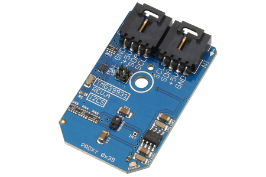

[](https://www.controleverything.com/content/Color?sku=TMG39931_I2CS)
# TMG39931
TMG39931 Color, ALS and Proximity Sensor

The TMG39931 provides color, IR light sensing and proximity using I²C communications.

This Device is available from ControlEverything.com [SKU: TMG39931_I2CS]

https://www.controleverything.com/content/Color?sku=TMG39931_I2CS

This Sample code can be used with Raspberry pi, Arduino and Beaglebone Black.

## Java
Download and install pi4j library on Raspberry pi. Steps to install pi4j are provided at:

http://pi4j.com/install.html

Download (or git pull) the code in pi.

Compile the java program.
```cpp
$> pi4j TMG39931.java
```

Run the java program.
```cpp
$> pi4j TMG39931
```

## Python
Download and install smbus library on Raspberry pi. Steps to install smbus are provided at:

https://pypi.python.org/pypi/smbus-cffi/0.5.1

Download (or git pull) the code in pi. Run the program.

```cpp
$> python TMG39931.py
```

## Arduino
Download and install Arduino Software (IDE) on your machine. Steps to install Arduino are provided at:

https://www.arduino.cc/en/Main/Software

Download (or git pull) the code and double click the file to run the program.

Compile and upload the code on Arduino IDE and see the output on Serial Monitor.


## C

Download (or git pull) the code in Beaglebone Black.

Compile the c program.
```cpp
$>gcc TMG39931.c -o TMG39931
```
Run the c program.
```cpp
$>./TMG39931
```
#####The code output is the proximity and lux value of IR and RGB luminance.
